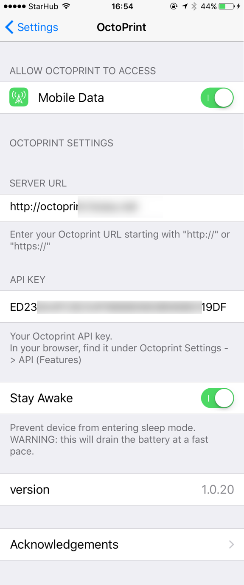
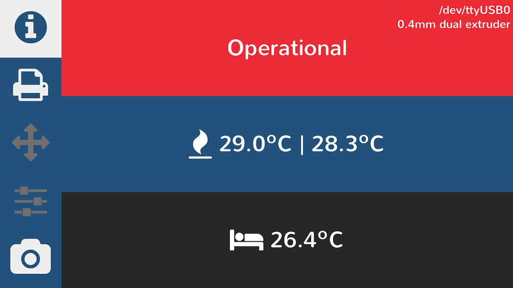
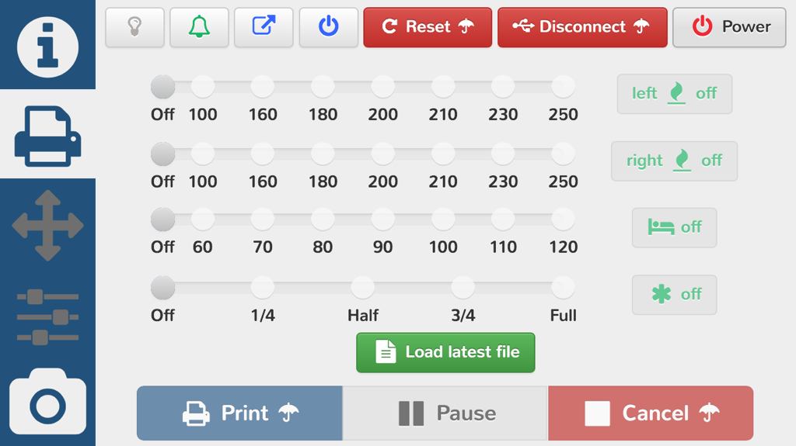
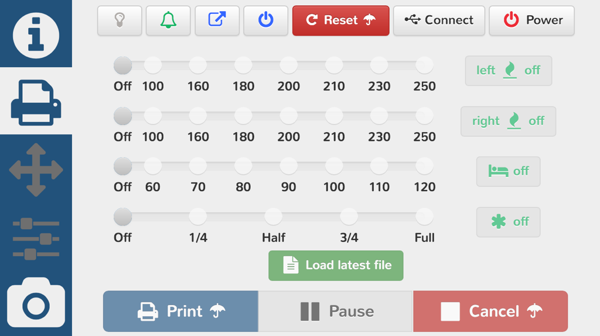
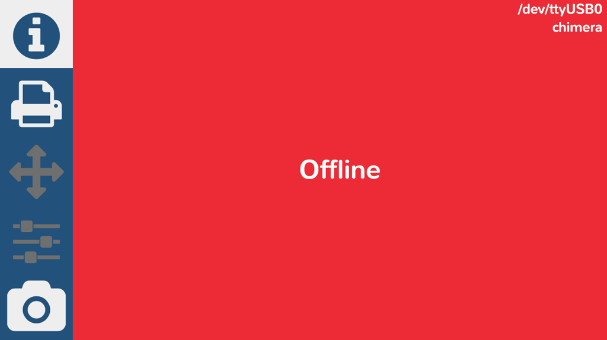
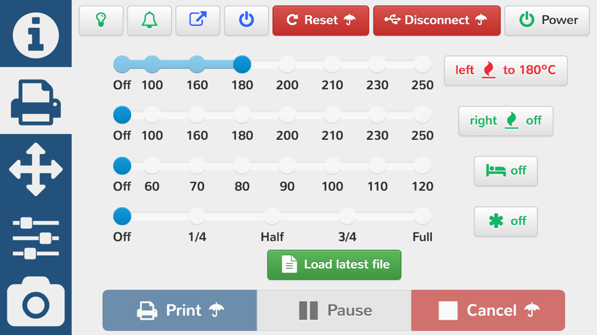
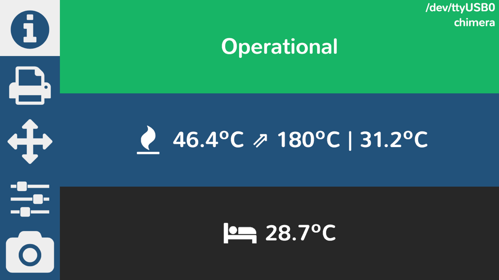
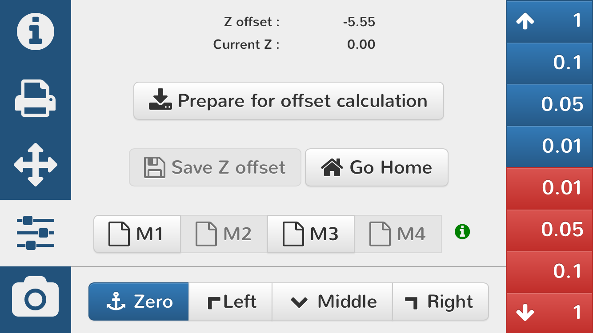
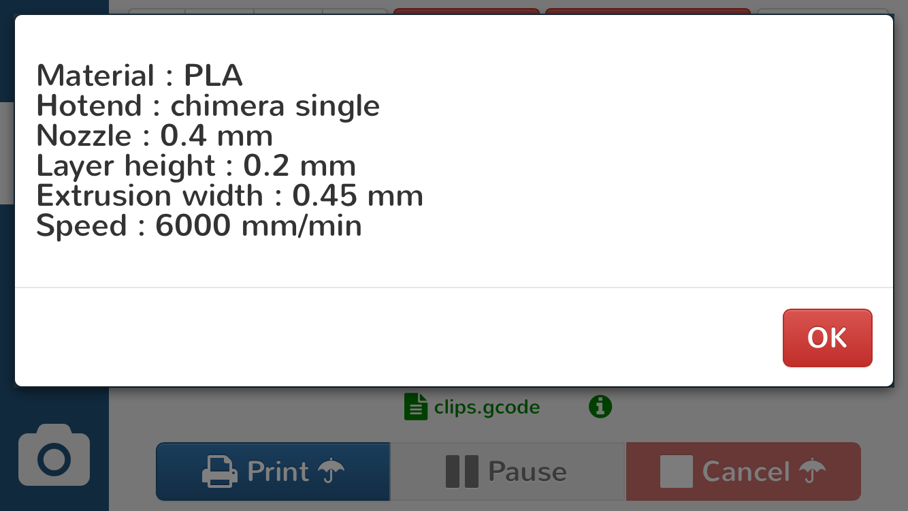

# Nautilus - mobile shell for OctoPrint


Octoprint simplified interface optimized for ios devices (only works on dev branch of Octoprint)

The iOS app will force landscape, maintain the API key and handle the server connection.

Bonus feature: shake to refresh.

The iOS app is available on [Apple AppStore](https://itunes.apple.com/us/app/id1125992543)

As long as octoprint is available over the internet, the UI changes to full screen webcam for pure monitoring. 

For notifications via Prowl, change settings by manually editing `config.yaml` under "plugins"

```
plugins:
  nautilus:
    prowl_key: [your_prowl_key]
```

`pyprowl` included from https://github.com/babs/pyrowl/tree/master

`settings.ini` under the plugin folder or it's corresponding data folder (`.octoprint/data/nautilus`) provides the gcode sequences for most of the functions provided. Make sure they are configured properly for your machine.

Some supplementary, non-core switch functions depend on a additional plugin which can be install separatly from [https://github.com/MoonshineSG/OctoPrint-Switch/archive/master.zip](https://github.com/MoonshineSG/OctoPrint-Switch/archive/master.zip). If the Switch plugin is not detected, the respective buttons are grey out and the printer is assumed to be powered on.


##Updates
 
 - ver 1.2  (plugin & ios) : For security reasons (API_KEY sent in clear), access is only allowed via the iOS app
 - ver 1.2.1 (plugin) : OctoPrint improved estimations, so own estimations based on marlin firmware have been removed
 - ver 1.3 (plugin & ios) : fix fan slider on disconnect, minor change to improve load time, camera pinch-zoom bug fix
 - ver 1.3.1 (plugin) : added macro info button, change the  way error messages are displayed, replace bootstrap-notify with bootbox.alert
 - ver 1.3.2 (plugin) : added estimate explanation
 - ver 1.3.3 (plugin) : fix info screen, time estimation background colour changes, additional macro (why not?)
 - ver 1.3.4 (plugin) : fix internal address checking
 - ver 1.3.5 (plugin) : allow editing "settings.ini" via the OctoPrint UI (under settings)
 
##screenshots
Setting page (under iOS Settings app)



iOS app splash screen


webapp loading screen


connection to octoprint server lost. it will retry 60 times every 2 seconds (2 minutes)


printer status screen (printer powered off). port and type of hotend (information taken from OctoPrint profile), dual nozzle and bed temperatures. 




printer command pannel. IR lights, sound, unload fillament when printing done, turn off printer when printing done (these require teh [Switch Pluing](https://github.com/MoonshineSG/OctoPrint-Switch plugin) )
reset printer (via GPIO - requires RPi GPIO - Printer Restet pin connection), disconnect and power on/off (GPIO relay). umbrela indicates commands with confirmation.  

temperature controls, load/unload file and print commands



disconnect printer (nothing is functional)




printer power on, controls are enabled, so are the additional pannels





several X,Y,Z,E movements

disabled while disconnected, offline and while printing


main reason why this app exists! nozzle offset (M851) setup!

all gcode sequences can be configured via "settings.ini" (from plugin folder or from data folder if present)

3 custom buttons available for additional commands (macro)

disabled as above



gcode file loaded


basic info about the file (provided by https://github.com/MoonshineSG/Simplify3D-to-OctoPrint)



status now shows material, nozzle and hot end types 


printing in progress


"emergency stop" while printing in progress (faster than "cancel")


webcam streaming (streaming start only when the pannel is activated and stops 30 seconds after deactivation). no zoom capability. tap to switch to full screen mode.


webcam in full screen with pinch zoom enabled (this is the only screen available when connected via internet). tap to switch to "normal" mode.


###Setup

1. Install via Plugin Manager or manually using this URL: [https://github.com/MoonshineSG/Octoprint-Mobile/archive/master.zip](https://github.com/MoonshineSG/Octoprint-Mobile/archive/master.zip)

2. Get iOS application from [Apple AppStore](https://itunes.apple.com/us/app/id1125992543) (or compile, sign and install the ios app - developer license from Apple needed)

3. Edit the gcodes via OctoPrint settings. Optionally the prowl key.

4. Configure the iOS app key in your iPhone/iPad settings.

