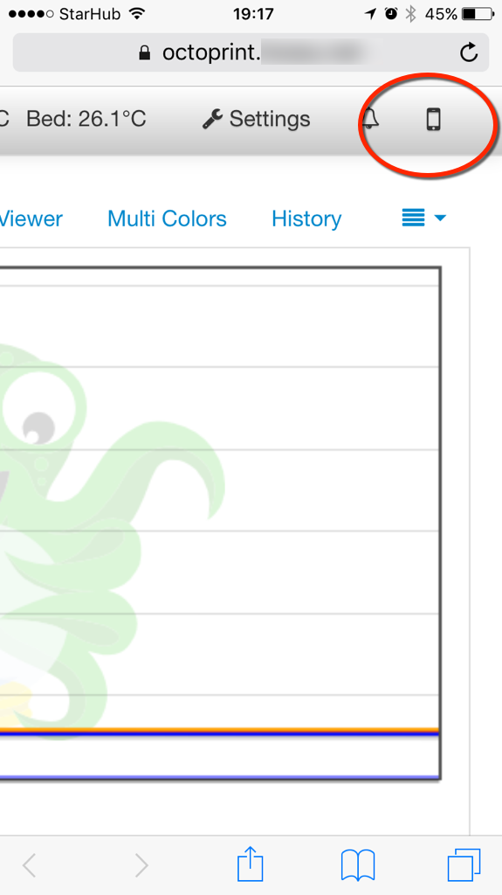
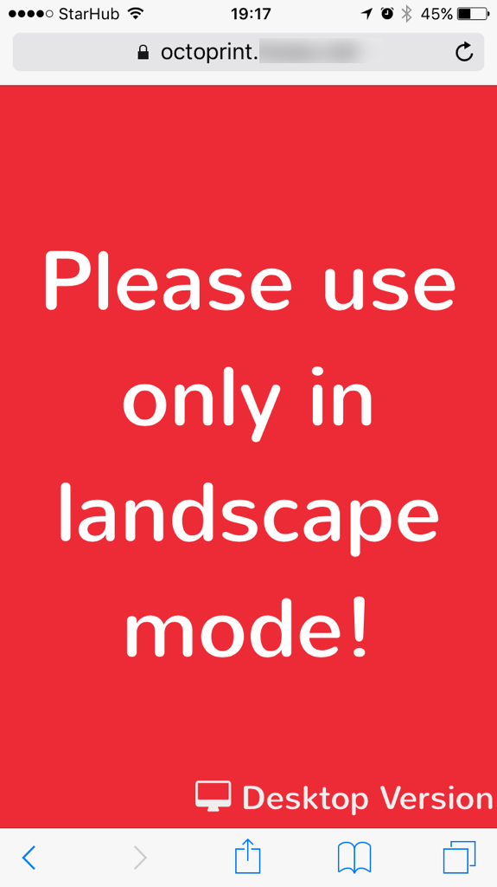

# Nautilus - mobile shell for OctoPrint


Octoprint simplified interface optimized for mobile devices (only works on dev branch of Octoprint)

The iOS app is needed to force landscape, load the API key and switch on/off the socket. 
Bonus feature: shake to refresh.

The iOS app is available on appstore: https://itunes.apple.com/us/app/id1125992543

When using the browser you can create a shortcut by using "Add to Home Screen" (it will be shown as "Nautilus")
Without the app constrains, the webapp has some alignment problems

As long as octoprint is available over the internet, the UI changes to full screen webcam for pure monitoring. 

For notifications via Prowl, change settings by manually editing `config.yaml` under "plugins"

```
plugins:
  nautilus:
    prowl_key: [your_prowl_key]
```

`pyprowl` included from https://github.com/babs/pyrowl/tree/master

`settings.ini` under the plugin folder or it's corresponding data folder (`.octoprint/data/nautilus`) provides the gcode sequences for most of the functions provided. Make sure they are configured properly for your machine.


##screenshots
Setting page (under iOS Settings app)


iOS app splash screen


links to mobile version when using browser on a mobile device or on the desktop




the webapp needs landscape mode. the iOS app forces the device on landscape



webapp loading screen


connection to octoprint server lost. it will retry 60 times every 2 seconds (2 minutes)


printer status screen (printer powered off). port and type of hotend (chimera/cyclops), dual nozzle and bed temperatures. 

the link to desktop version appears only on the browser (not when using the iOS app)


printer command pannel. IR lights, sound, unload fillament when printing done, turn off printer when printing done (these require https://github.com/MoonshineSG/OctoPrint-Switch plugin)
reset printer (GPIO), disconnect and power on/off (GPIO relay). umbrela indicates commands with confirmation.  

temperature controls, load/unload file and print commands


disconnect printer (nothing is functional)


printer power on, controls are enabled, so are the additional pannels


several X,Y,Z,E movements

disabled while disconnected, offline and while printing


main reason why this app exists! nozzle offset (M851) setup!

all gcode sequences can be configured via "settings.ini" (from plugin folder or from data folder if present)

3 custom buttons available for additional commands (macro)

disabled as above


gcode file loaded


basic info about the file (provided by https://github.com/MoonshineSG/Simplify3D-to-OctoPrint)


status now shows material, nozzle and hot end types 


printing in progress


"emergency stop" while printing in progress (faster than "cancel")


webcam streaming (streaming start only when the pannel is activated and stops 30 seconds after deactivation). no zoom capability. tap to switch to full screen mode.


webcam in full screen with pinch zoom enabled (this is the only screen available when connected via internet). tap to switch to "normal" mode.


###Setup

1. Manually install the plugin from `octoprint_mobile` to ~/.octoprint/plugins/mobile

2. Compile, sign and install the ios app. Free developer license from Apple needed.


#More....


_This is part of a integrated solution to create a smooth 3D printing experience by "gluing" the individual software and hardware players_

##Simplify3D - the slicer

Models (downloaded or created by Fusion360) are loaded and sliced based on selected material/quality/extruder-nozzle combo.

The "auto-select" `material` and `extruders` have names that will eventually be displyed in the "Info" tab of the mobile octoprint

The "Starting Script" ends with `"; ------------ START GCODE ----------"`. This will be used later.

Once the code file gets generated, Simplify3D executes the postprocessing sequence 

```
{REPLACE "; layer" "M808 zchange Layer"} 
{REPLACE " Z = " " "}
/full_path_to/toctoprint.py  trash select estimate --gcode "[output_filepath]"
```

See https://github.com/MoonshineSG/Simplify3D-to-OctoPrint

Estimations provided by https://github.com/MoonshineSG/marlin-estimate. _Currently not very accurate._

## RaspberryPi - the brain 

runs Octoprint and has a couple of opto relays connected to the GPIO pins as well as direct control over the reset PIN 
of the 3D printer board (see  https://github.com/MoonshineSG/emergency-button).

## Octoprint - the controler 

A few plugins assist the main software:

* replacemnt UI for octoprint on mobile devices mobile https://github.com/MoonshineSG/OctoPrint-Mobile

* GPIO are controlled by https://github.com/MoonshineSG/OctoPrint-Switch

* MP3 sounds https://github.com/MoonshineSG/OctoPrint-Sound

* additional tiny helpers https://github.com/MoonshineSG/OctoPrint-Plugins

## Marlin - the firmware

customised firmware with additional commands

* M808: echo parameters as `//action:`

* M889: cooling fan for end of print sequence (works with `TEMP_STAT_LEDS`)

around line #8372
```
digitalWrite(STAT_LED_BLUE, new_led ? LOW : HIGH);
if (! new_led ) {
  enqueue_and_echo_commands_P(PSTR("M889 C0"));
  SERIAL_PROTOCOLLN("//action:cooled");
}

```

* M890: swappable extruder (see https://github.com/MarlinFirmware/Marlin/issues/3980)

_All changes available at_ https://github.com/MoonshineSG/Marlin

## Opto relays the workers
used as printer power and IR lights switches